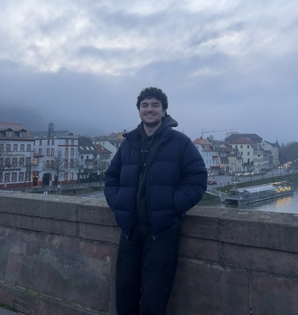

  

👋 Hello! It's nice to meet you. I'm **Murad Isayev**, and it's my tiny space on the web.

I am a Software Engineer based in Central Germany.
I love learning about technology and figuring out how things work under the hood, usually rubberducking with the lovely duck next to my keyboard. Obsessed with [Go](https://go.dev/), and my favorite IDE is [NeoVim](https://neovim.io/). Besides tech, I enjoy music, chess, working out and solo dating.
You can learn more [about me](/about), and see what I'm up to [right now](/now).

* [GitHub](https://github.com/MuradIsayev)
* [LinkedIn](https://linkedin.com/in/muradisayev)
* [Email](mailto:isayev.murad@outlook.com)

